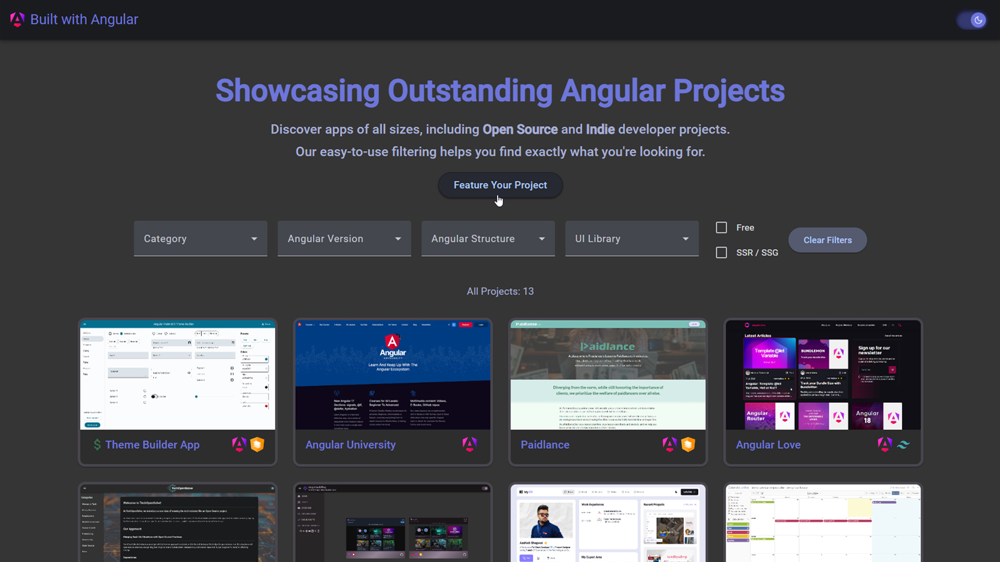

# Built With Angular

## About

Built With Angular is a platform where developers can showcase their Angular projects. It is designed to promote all kinds of projects, providing a unique opportunity for developers to gain visibility and even earn money by featuring their paid projects.

### Key Features

- **Showcase Your Work**: Developers can submit their Angular projects to be featured on the platform, allowing them to share their work with a broader audience.
- **Promote Open Source**: Open source projects can gain more traction and contributors by being featured.
- **Earn Money**: In addition to free projects, paid projects can also be featured, providing developers with a potential revenue stream.
- **Search and Filtering**: Users can easily search and filter projects based on various criteria, making it simple to find relevant projects of interest.

---

### Thank you for your interest in [**BuiltWithAngular**](https://builtwithangular.dev). 

## We look forward to seeing your amazing projects!
