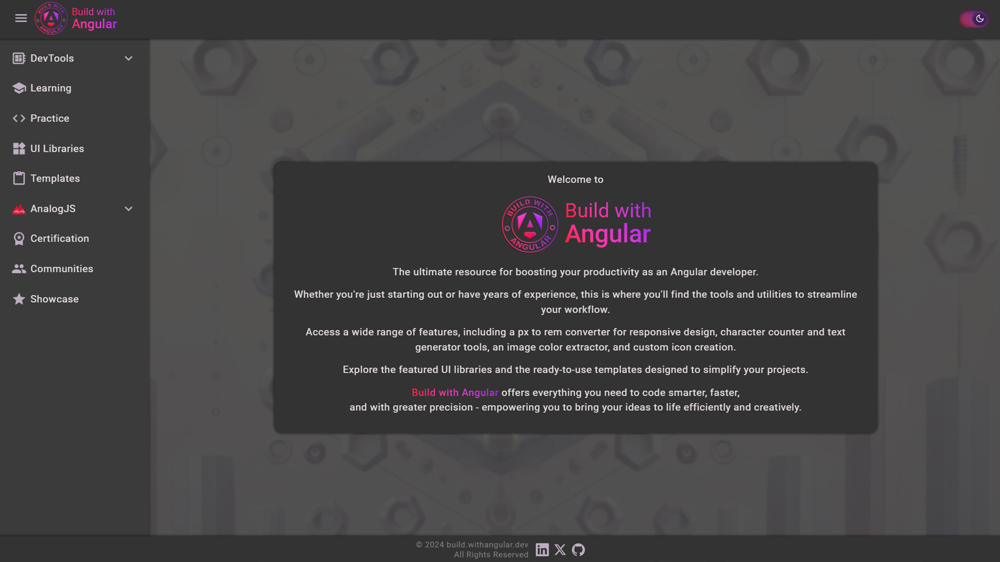

# Build with Angular

## About

### Build with Angular is the ultimate platform for Angular developers seeking to enhance their productivity, streamline their workflows, and expand their skills. Whether you're just beginning your Angular journey or are a seasoned professional, Build with Angular provides everything you need to succeed.

With a comprehensive suite of tools, learning resources, and curated references, Build with Angular empowers you to code smarter, faster, and more creatively.

---

## Key Features

### **DevTools**
A collection of tools to simplify common development tasks and boost your efficiency:

- **Style**:  
  - **Px to Rem** Converter for responsive design.  
  - Image **Color Extractor** to extract colors from images.

- **Text**:  
  - **Convert Case** and **Character Counter** tool for transforming text cases and text analysis.  
  - **Lorem Ipsum Generator** for quick placeholder text.  
  - **Fonts** Explorer for discovering and managing typefaces.

- **Icons**:  
  - [SOON] **PNG to SVG** Converter for efficient icon management.  
  - [SOON] **Icon** Search for finding the perfect icon for your projects. 

---

### **Learning**
Access a wealth of educational resources to deepen your Angular knowledge:
- The official **Angular Documentation** reference.
- **Roadmaps** to guide your learning journey.  
- **Tutorials** covering practical and advanced Angular concepts.  
- A curated list of **Books** on Angular development.

---

### **Practice**
Improve your skills and gain hands-on experience with:
- References to the best **Coding Platforms** to practice Angular.  
- Recommendations for powerful **IDEs** tailored for Angular development.

### **Building Blocks**
Pre-designed resources and foundational elements to to streamline your Angular development and accelerate project completion:

- **UI Libraries**
Discover and utilize the most popular Angular UI libraries:
  - **Angular Material**: The official Angular component library for a modern and consistent UI.  
  - **PrimeNG**: A rich set of UI components for Angular applications.
  - **DevExtreme** and more

- **NPM Packages**
Discover additional NPM packages to enhance your Angular applications and development experience.

- **Templates**
Leverage pre-built, ready-to-use **Templates** to kickstart your Angular projects and save development time.

---

### **AnalogJS**
A dedicated section for **AnalogJS**, the cutting-edge meta-framework for Angular, including:

- **Learning** resources: 
  - The official **AnalogJS Documentation** reference.
  - Tutorials 
  - Books 

- Ready-to-use **Templates** for fast development with AnalogJS.

- NPM packages

---

### **Additional Sections**
- **Certification**: Information about Angular certifications and recognition programs.  

- **Communities**: Explore vibrant Angular communities to connect with other developers.  

- **Showcase**:  
  - A link to [**Built With Angular**](https://built.withangular.dev), the perfect place to showcase your completed Angular projects.  
  - **Built With Angular** is designed to highlight outstanding Angular projects, offering developers an opportunity to gain visibility and even monetize their paid projects.  

---

### Thank you for your interest in [**Build with Angular**](https://build.withangular.dev).

## Explore, learn, and create with confidence. Build with Angular empowers you to bring your ideas to life efficiently and creatively!
